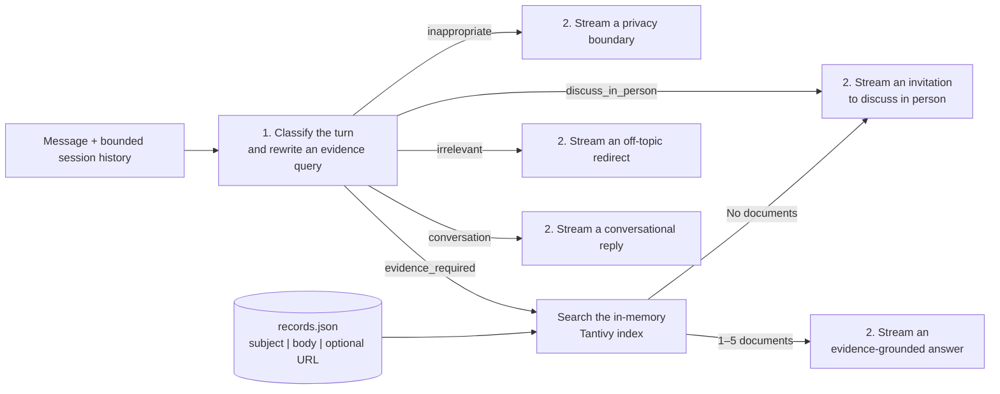

<div align="center">
  
  <h1>Me-as-a-Service</h1>
  <p>
    <em>Because a résumé doesn’t answer follow-up questions.</em><br>
    Turn yours into an evidence-grounded conversational portfolio that answers
    them without inventing personal claims.
  </p>
  <p>
    <strong><a href="https://chat.danjia.me/">Try the live profile</a></strong>
    &nbsp;&middot;&nbsp;
    <strong><a href="#create-your-own-profile">Create your own profile</a></strong>
  </p>
  <p>
    <a href="https://chat.danjia.me/"></a>
    <a href="https://github.com/danjia21/me-as-a-service/actions/workflows/ci.yml"></a>
    <a href="LICENSE"></a>
    
    
  </p>
</div>

Me-as-a-Service is an open-source engine for building a conversational profile
from a résumé and other documented work. Instead of searching through static
pages, visitors can ask broad questions, follow up naturally, and change the
level of technical detail without restating the context.

Profile content stays separate from the code, so the same open-source system
can represent different people. The assistant speaks in the first person,
remembers context within the current session, and grounds personal claims in a
curated knowledge base. Its scope is intentionally limited: unrelated requests
are redirected, private requests receive a natural boundary, and unsupported
personal or connected public questions are answered without guessing.

> [!IMPORTANT]
> The assistant represents a person; it is not the person. Never add private or
> sensitive material to the public knowledge base.

## Start here

| I want to…                     | Start with…                                                                                                                                                  |
| ------------------------------ | ------------------------------------------------------------------------------------------------------------------------------------------------------------ |
| See the experience             | [Talk to Dan's live AI representation](https://chat.danjia.me/) and ask a suggested question, then follow up in your own words.                              |
| Build my own profile           | [Create a profile from a PDF or Markdown résumé](#create-your-own-profile) using the included Codex or Claude Code skill and editable local knowledge index. |
| Understand the implementation  | Read [How it works](#how-it-works) for the fixed two-call workflow and local retrieval design.                                                               |
| Run or contribute to the stack | Follow the [Quick start](#quick-start), then review the open issues and [contribution guide](CONTRIBUTING.md).                                               |

## Who it is for

Me-as-a-Service is designed for engineers, researchers, consultants, and other
professionals whose work cannot be explained well by a list of résumé bullets.
It is also a reference implementation for developers exploring conversational
RAG, grounded generation, evaluation, privacy boundaries, and production LLM
operations without introducing a dynamic agent loop.

## How it works

Each accepted turn follows one fixed path with exactly two hosted-model calls:



The first call sees the current message and bounded raw session history. It returns one
of five conversation types and, only for `evidence_required`, a standalone retrieval
query. This lets a follow-up such as "What happened next?" search correctly without
making retrieval part of the model's generation request.

Evidence retrieval is local. The API builds one in-memory Tantivy index from the
selected instance's `index/records.json` at startup and returns up to five complete
records in relevance order. When records are found, their subject, body, and optional
canonical URL are added to the current generation message. Internal IDs and search
scores never leave the retrieval layer. If no record matches, the route uses the
`discuss_in_person` policy instead of asking the model to improvise an answer.

The second call is an ordinary streamed chat completion using the response policy for
the selected type. Evidence and conversational replies retain bounded history for
continuity; privacy boundaries, off-topic redirects, and discuss-in-person replies use
only the current message. The completed raw user message and generated answer are then
stored as session history. They never become trusted profile knowledge.

The routing is deliberately simple: there is no agent loop, model-driven tool call,
evidence-sufficiency pass, web search, or post-generation classifier. Keeping the
request path fixed and short controls latency and model cost. Instead of adding more
generation steps, the system relies on a carefully curated retrieval base to supply
the strong evidence needed for high-quality answers. The curated index is the only
runtime factual source for personal claims and connected public facts. Prompts are
versioned with the code, and optional LangSmith traces expose the two model calls for
inspection.

## Features

- [x] Hold evidence-grounded conversations with contextual follow-ups
- [x] Stream responses through a simple, low-cost retrieval path
- [x] Create reusable profiles from PDF or Markdown résumés
- [x] Use models from OpenAI or OpenRouter
- [x] Persist conversations and control traffic and model usage
- [x] Trace model calls with LangSmith
- [x] Monitor operations with Prometheus and Grafana
- [ ] Let visitors rate responses
- [ ] Automatically evaluate answer quality and evidence grounding
- [ ] Explore advanced retrieval when the results justify the added cost
- [ ] Support voice conversations

## Quick start

Prerequisites: Node.js 24, pnpm 11, Python 3.12+,
uv, Docker, and an API key from OpenAI or
OpenRouter.

```bash
cp .env.example .env
pnpm install
uv sync --project apps/api --all-groups
docker compose up -d postgres
pnpm dev
```

Add your provider credentials to `.env`. OpenAI is the default:

```dotenv
MAAS_LLM_PROVIDER=openai
OPENAI_API_KEY=your-key
```

To use OpenRouter instead, select it and use an OpenRouter model ID:

```dotenv
MAAS_LLM_PROVIDER=openrouter
MAAS_LLM_MODEL=deepseek/deepseek-v4-flash
OPENROUTER_API_KEY=your-key
```

The web app runs at <http://localhost:3000> and the API at
<http://localhost:8000>. See [`.env.example`](.env.example) for the available
local configuration.

## Configuration

Copy [`.env.example`](.env.example) for local development or
[`.env.production.example`](.env.production.example) for a production Compose
deployment. Keep credentials and other secrets out of Git.

| Area               | Variable                              | Default                 | Description                                                                                     |
| ------------------ | ------------------------------------- | ----------------------- | ----------------------------------------------------------------------------------------------- |
| Application        | `MAAS_API_BASE_URL`                   | `http://127.0.0.1:8000` | API URL used by the web app.                                                                    |
| Application        | `MAAS_INSTANCE_DIR`                   | `instance/example`      | Instance directory loaded by the API and web app.                                               |
| Application        | `MAAS_CONVERSATION_STORE`             | `memory`                | Conversation and usage store: `memory` or `postgres`. The local example selects `postgres`.     |
| Application        | `DATABASE_URL`                        | Required for `postgres` | PostgreSQL connection URL used by the API.                                                      |
| Application        | `MAAS_CONVERSATION_RETENTION_HOURS`   | `24`                    | PostgreSQL conversation retention period in hours.                                              |
| Application        | `MAAS_MAX_TURNS_PER_CONVERSATION`     | `20`                    | Maximum accepted turns in one conversation.                                                     |
| Application        | `MAAS_DAILY_TOKEN_BUDGET`             | `100000`                | Application-wide daily model-token budget.                                                      |
| Application        | `MAAS_MAX_OUTPUT_TOKENS`              | `300`                   | Maximum model output tokens per generation.                                                     |
| Model              | `MAAS_LLM_PROVIDER`                   | `openai`                | Hosted model provider: `openai` or `openrouter`.                                                |
| Model              | `MAAS_LLM_MODEL`                      | Provider-dependent      | Model ID; defaults to `gpt-5.6-luna` for OpenAI or `deepseek/deepseek-v4-flash` for OpenRouter. |
| Model              | `OPENAI_API_KEY`                      | Required for OpenAI     | OpenAI API key.                                                                                 |
| Model              | `OPENROUTER_API_KEY`                  | Required for OpenRouter | OpenRouter API key.                                                                             |
| Traffic            | `MAAS_IP_RATE_LIMIT_REQUESTS`         | `30`                    | Requests allowed per client IP in each rate-limit window.                                       |
| Traffic            | `MAAS_SESSION_RATE_LIMIT_REQUESTS`    | `12`                    | Requests allowed per conversation in each rate-limit window.                                    |
| Traffic            | `MAAS_RATE_LIMIT_WINDOW_SECONDS`      | `60`                    | Rate-limit window length in seconds.                                                            |
| Traffic            | `MAAS_MAX_CONCURRENT_TURNS`           | `4`                     | Maximum turns processed concurrently by one API process.                                        |
| Traffic            | `MAAS_MAX_QUEUED_TURNS`               | `8`                     | Maximum turns waiting for processing.                                                           |
| Traffic            | `MAAS_QUEUE_TIMEOUT_SECONDS`          | `15`                    | Maximum time a queued turn waits before rejection.                                              |
| Security           | `MAAS_PROXY_SHARED_SECRET`            | Empty                   | Shared secret used to authenticate the web-to-API proxy; required by the production deployment. |
| Security           | `MAAS_METRICS_BEARER_TOKEN`           | Empty                   | Bearer token protecting the API metrics endpoint.                                               |
| Security           | `MAAS_METRICS_BEARER_TOKEN_FILE`      | Empty                   | Path to a file containing the metrics bearer token; takes precedence over the inline token.     |
| Web analytics      | `MAAS_DOMAIN`                         | Empty                   | Public hostname used for the Cloudflare visit counter and production routing.                   |
| Web analytics      | `CLOUDFLARE_ACCOUNT_ID`               | Empty                   | Cloudflare account ID used by the server-side analytics query.                                  |
| Web analytics      | `CLOUDFLARE_ANALYTICS_API_TOKEN`      | Empty                   | Cloudflare API token with analytics read access.                                                |
| Web analytics      | `CLOUDFLARE_ANALYTICS_SITE_TOKEN`     | Empty                   | Cloudflare Web Analytics site token embedded in the web build.                                  |
| Tracing            | `LANGSMITH_TRACING`                   | `false`                 | Enables optional LangSmith tracing when set to `true`.                                          |
| Tracing            | `LANGSMITH_API_KEY`                   | Empty                   | LangSmith API key; required when tracing is enabled.                                            |
| Tracing            | `LANGSMITH_PROJECT`                   | `me-as-a-service`       | LangSmith project receiving traces.                                                             |
| Tracing            | `LANGSMITH_ENDPOINT`                  | LangSmith default       | Optional LangSmith API endpoint for a non-default region.                                       |
| Tracing            | `LANGSMITH_WORKSPACE_ID`              | Empty                   | Optional LangSmith workspace ID.                                                                |
| Runtime            | `MAAS_ENVIRONMENT`                    | Runtime-dependent       | Environment label attached to logs and traces. Production Compose sets `production`.            |
| Runtime            | `MAAS_APPLICATION_REVISION`           | `unknown`               | Application revision attached to trace metadata.                                                |
| Runtime            | `MAAS_GRACEFUL_SHUTDOWN_SECONDS`      | `30`                    | API graceful-shutdown timeout in seconds.                                                       |
| Runtime            | `PORT`                                | `8000`                  | API listening port when starting the Python runtime directly.                                   |
| Local Compose      | `POSTGRES_PASSWORD`                   | `maas`                  | Password assigned to the local PostgreSQL container.                                            |
| Production Compose | `COMPOSE_PROJECT_NAME`                | `maas` in the example   | Docker Compose project name.                                                                    |
| Production Compose | `MAAS_DOCKER_NETWORK_PREFIX`          | `maas`                  | Prefix for named production Docker networks.                                                    |
| Production Compose | `MAAS_ACME_EMAIL`                     | Required                | Email address used for Let’s Encrypt certificate registration.                                  |
| Production Compose | `MAAS_INSTANCE_DIR_HOST`              | `./instance/example`    | Host instance directory mounted into the application containers.                                |
| Production Compose | `MAAS_TRAEFIK_TRUSTED_IPS`            | `127.0.0.1/32`          | Comma-separated proxy CIDRs trusted by Traefik for forwarded headers.                           |
| Production Compose | `POSTGRES_DB`                         | Required                | Production PostgreSQL database name.                                                            |
| Production Compose | `POSTGRES_USER`                       | Required                | Production PostgreSQL user.                                                                     |
| Production Compose | `POSTGRES_PASSWORD`                   | Required                | Production PostgreSQL password.                                                                 |
| Production secrets | `MAAS_METRICS_BEARER_TOKEN_FILE_HOST` | Required                | Host file mounted as the API metrics-token secret.                                              |
| Backups            | `RESTIC_REPOSITORY`                   | Required                | Restic repository URL for encrypted backups.                                                    |
| Backups            | `RESTIC_PASSWORD_FILE_HOST`           | Required                | Host file containing the restic repository password.                                            |
| Backups            | `AWS_ACCESS_KEY_ID`                   | Required                | Access key for the S3-compatible backup store.                                                  |
| Backups            | `AWS_SECRET_ACCESS_KEY`               | Required                | Secret key for the S3-compatible backup store.                                                  |
| Backups            | `AWS_DEFAULT_REGION`                  | Empty                   | Region for the S3-compatible backup store.                                                      |
| Backups            | `MAAS_BACKUP_RETENTION_DAILY`         | `7`                     | Number of daily backup snapshots retained.                                                      |
| Backups            | `MAAS_BACKUP_RETENTION_WEEKLY`        | `4`                     | Number of weekly backup snapshots retained.                                                     |
| Observability      | `GRAFANA_ADMIN_USER`                  | `admin`                 | Initial Grafana administrator username.                                                         |
| Observability      | `GRAFANA_ADMIN_PASSWORD`              | Required                | Initial Grafana administrator password.                                                         |
| Observability      | `MAAS_GRAFANA_BIND_ADDRESS`           | `127.0.0.1`             | Host address used for the Grafana port binding.                                                 |
| Observability      | `MAAS_ALERTMANAGER_CONFIG`            | Example config          | Host path to the Alertmanager configuration file.                                               |

## Create your own profile

Profiles live under `instance/<profile-name>/`. To create one, give Codex or Claude
Code a PDF or Markdown résumé and ask it to use the
[`initialize-knowledge-base`](.agents/skills/initialize-knowledge-base/SKILL.md)
skill. For example:

> Use the initialize-knowledge-base skill to create my profile at
> `instance/my-profile` from `/path/to/resume.pdf`.

The skill first creates a complete, immediately usable profile from the résumé. It
retains the original input, normalizes its text, configures the profile's public
presentation, writes the live retrieval records, and creates 10 résumé-informed
questions for evaluating evidence retrieval. It validates this baseline before any
optional enrichment, so an interrupted session still leaves a working profile.

Codex or Claude Code can then add clearly matched information from authoritative
public sources and ask up to three focused interview questions to fill important
gaps. Useful answers are rewritten as concise professional prose and added
immediately; rough replies are never stored verbatim. Corrections update the same
live index without a separate build or publication step.

Each profile has a deliberately small structure:

```text
instance/my-profile/
|-- instance.yaml
|-- evaluations/evidence_required.json
|-- inputs/resume/
|   |-- original
|   |-- normalized.md
|   `-- metadata.json
`-- index/records.json
```

`instance.yaml` controls the name, disclosure, welcome text, suggested questions,
and public links shown by the web app. `index/records.json` is the retrieval base used
directly by the API; each record contains only a stable ID, subject, body, and optional
canonical URL. The evaluation file is used by the live evaluation command and is not
loaded during normal web requests.

Set the new profile as the local default in `.env`:

```dotenv
MAAS_INSTANCE_DIR=instance/my-profile
```

The skill uses the deterministic, atomic commands in `tools/knowledge-cli`. You can
also inspect or validate a profile directly:

```bash
cd tools/knowledge-cli
uv sync --all-groups
uv run maas knowledge status --instance /absolute/path/to/instance
uv run maas knowledge validate --instance /absolute/path/to/instance
```

Run the profile's 10 evidence-required questions through the production conversation
path with:

```bash
pnpm --filter @me-as-a-service/api eval:evidence-required-response
```

To deploy your instance, we recommend a VPS with at least 2 GB of RAM.
You will need a domain name, an OpenAI or OpenRouter API key, and
production secrets kept outside Git. See the
[production deployment guide](doc/PRODUCTION_DEPLOYMENT.md) for the complete runbook.

## Changelog

- [2026-09-15] Simplified chat routing to two model calls with direct local retrieval;
  added the live JSON knowledge index, skill-led profile creation, instance-specific
  evaluations, reusable example profile, and updated production operations.
- [2026-08-03] Initial public release

## Contribution

Contributions are welcome. See [CONTRIBUTING.md](CONTRIBUTING.md) for the
development workflow and contribution guidelines.

> [!IMPORTANT]
> Before opening a pull request, inspect the complete diff and keep all private
> instance information out of it, including résumés, retrieval records, evaluation
> questions, interview material, and personal links. Public contributions should use
> only the fictional `instance/example/` profile.

## License

The software, documentation, tooling, and fictional `instance/example/` profile are
licensed under Apache-2.0. See [LICENSE](LICENSE).

Personal profile content, source documents, biographical writing, interview material,
voice, and likeness are not covered by the Apache-2.0 license unless an adjacent
license explicitly says otherwise. Private instance material must not be copied or
redistributed.
