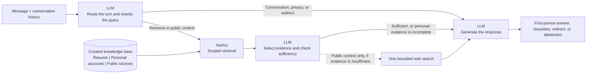

<div align="center">
  
  <h1>Me-as-a-Service</h1>
  <p><em>Because my résumé doesn’t answer follow-up questions.</em></p>
  <p>
    <a href="https://chat.danjia.me/"></a>
    <a href="https://github.com/danjia21/me-as-a-service/actions/workflows/ci.yml"></a>
    <a href="LICENSE"></a>
    
    
  </p>
</div>

Me-as-a-Service turns a résumé and other documented work into an
evidence-grounded conversational portfolio. Visitors can ask follow-up
questions instead of searching through static pages. Behind the conversation,
the application handles multi-turn context, RAG, evaluation, bounded web
search, observability, and privacy controls.

Profile content stays separate from the code, so the same open-source system
can represent different people. The assistant speaks in the first person,
remembers context within the current session, and grounds personal claims in a
curated knowledge base. Its scope is intentionally limited: unrelated requests
are redirected, while public contextual questions may use one web search only
after curated retrieval is insufficient.

> [!IMPORTANT]
> The assistant represents a person; it is not the person. Never add private or
> sensitive material to the public knowledge base.

## How it works

The system uses one configured LLM, through OpenAI or OpenRouter, for routing,
evidence assessment, and response generation. The LLM carries the conversation,
but the curated knowledge base remains the authority for personal claims.



Routing comes first. A structured LLM call reads the latest message with recent
session history, assigns a route, and rewrites contextual follow-ups into
standalone search queries. A question such as "What happened next?" can
therefore retrieve the right material. Greetings continue as conversation,
sensitive requests receive a privacy boundary, and unrelated requests are
redirected. Only personal and public-context questions reach retrieval.

Retrieval searches three independent parts of the knowledge base: the résumé,
approved personal accounts, and curated public sources. Each has its own
in-memory Tantivy index, so a large collection of public material cannot crowd
out first-person evidence. The search returns up to one résumé passage and
three passages from each of the other scopes.

Search ranking is not treated as proof. Another structured LLM call selects the
passages that directly support the question and decides whether they are enough
to answer it. Only those selected passages enter the final prompt. If the
personal evidence is incomplete, the response says so rather than guessing. A
public-context question may use one bounded web search, but only after the
curated knowledge base falls short. Web results cannot establish new claims
about the represented person.

The final LLM call combines the route-specific prompt, recent conversation, and
any selected evidence to produce a concise first-person response. Conversation
history provides short-term context only. It never becomes trusted knowledge.
Routing rules, prompts, and evaluation fixtures are versioned with the code,
and optional LangSmith traces expose each step for inspection.

## Quick start

Prerequisites: Node.js 24, pnpm 11, Python 3.12+,
uv, Docker, and an API key from OpenAI or
OpenRouter.

```bash
cp .env.example .env
pnpm install
uv sync --project apps/api --all-groups
docker compose up -d postgres
pnpm dev
```

Add your provider credentials to `.env`. OpenAI is the default:

```dotenv
MAAS_LLM_PROVIDER=openai
OPENAI_API_KEY=your-key
```

To use OpenRouter instead, select it and use an OpenRouter model ID:

```dotenv
MAAS_LLM_PROVIDER=openrouter
MAAS_LLM_MODEL=deepseek/deepseek-v4-flash
OPENROUTER_API_KEY=your-key
```

The web app runs at <http://localhost:3000> and the API at
<http://localhost:8000>. See [`.env.example`](.env.example) for the available
local configuration.

## Configuration

Copy [`.env.example`](.env.example) for local development or
[`.env.production.example`](.env.production.example) for a production Compose
deployment. Keep credentials and other secrets out of Git.

| Area               | Variable                              | Default                        | Description                                                                                     |
| ------------------ | ------------------------------------- | ------------------------------ | ----------------------------------------------------------------------------------------------- |
| Application        | `MAAS_API_BASE_URL`                   | `http://127.0.0.1:8000`        | API URL used by the web app.                                                                    |
| Application        | `MAAS_INSTANCE_DIR`                   | `examples/fictional-profile`   | Instance directory loaded by the API and web app.                                               |
| Application        | `MAAS_CONVERSATION_STORE`             | `memory`                       | Conversation and usage store: `memory` or `postgres`. The local example selects `postgres`.     |
| Application        | `DATABASE_URL`                        | Required for `postgres`        | PostgreSQL connection URL used by the API.                                                      |
| Application        | `MAAS_CONVERSATION_RETENTION_HOURS`   | `24`                           | PostgreSQL conversation retention period in hours.                                              |
| Application        | `MAAS_MAX_TURNS_PER_CONVERSATION`     | `20`                           | Maximum accepted turns in one conversation.                                                     |
| Application        | `MAAS_DAILY_TOKEN_BUDGET`             | `100000`                       | Application-wide daily model-token budget.                                                      |
| Application        | `MAAS_MAX_OUTPUT_TOKENS`              | `300`                          | Maximum model output tokens per generation.                                                     |
| Model              | `MAAS_LLM_PROVIDER`                   | `openai`                       | Hosted model provider: `openai` or `openrouter`.                                                |
| Model              | `MAAS_LLM_MODEL`                      | Provider-dependent             | Model ID; defaults to `gpt-5.6-luna` for OpenAI or `deepseek/deepseek-v4-flash` for OpenRouter. |
| Model              | `OPENAI_API_KEY`                      | Required for OpenAI            | OpenAI API key.                                                                                 |
| Model              | `OPENROUTER_API_KEY`                  | Required for OpenRouter        | OpenRouter API key.                                                                             |
| Traffic            | `MAAS_IP_RATE_LIMIT_REQUESTS`         | `30`                           | Requests allowed per client IP in each rate-limit window.                                       |
| Traffic            | `MAAS_SESSION_RATE_LIMIT_REQUESTS`    | `12`                           | Requests allowed per conversation in each rate-limit window.                                    |
| Traffic            | `MAAS_RATE_LIMIT_WINDOW_SECONDS`      | `60`                           | Rate-limit window length in seconds.                                                            |
| Traffic            | `MAAS_MAX_CONCURRENT_TURNS`           | `4`                            | Maximum turns processed concurrently by one API process.                                        |
| Traffic            | `MAAS_MAX_QUEUED_TURNS`               | `8`                            | Maximum turns waiting for processing.                                                           |
| Traffic            | `MAAS_QUEUE_TIMEOUT_SECONDS`          | `15`                           | Maximum time a queued turn waits before rejection.                                              |
| Security           | `MAAS_PROXY_SHARED_SECRET`            | Empty                          | Shared secret used to authenticate the web-to-API proxy; required by the production deployment. |
| Security           | `MAAS_METRICS_BEARER_TOKEN`           | Empty                          | Bearer token protecting the API metrics endpoint.                                               |
| Security           | `MAAS_METRICS_BEARER_TOKEN_FILE`      | Empty                          | Path to a file containing the metrics bearer token; takes precedence over the inline token.     |
| Web analytics      | `MAAS_DOMAIN`                         | Empty                          | Public hostname used for the Cloudflare visit counter and production routing.                   |
| Web analytics      | `CLOUDFLARE_ACCOUNT_ID`               | Empty                          | Cloudflare account ID used by the server-side analytics query.                                  |
| Web analytics      | `CLOUDFLARE_ANALYTICS_API_TOKEN`      | Empty                          | Cloudflare API token with analytics read access.                                                |
| Web analytics      | `CLOUDFLARE_ANALYTICS_SITE_TOKEN`     | Empty                          | Cloudflare Web Analytics site token embedded in the web build.                                  |
| Tracing            | `LANGSMITH_TRACING`                   | `false`                        | Enables optional LangSmith tracing when set to `true`.                                          |
| Tracing            | `LANGSMITH_API_KEY`                   | Empty                          | LangSmith API key; required when tracing is enabled.                                            |
| Tracing            | `LANGSMITH_PROJECT`                   | `me-as-a-service`              | LangSmith project receiving traces.                                                             |
| Tracing            | `LANGSMITH_ENDPOINT`                  | LangSmith default              | Optional LangSmith API endpoint for a non-default region.                                       |
| Tracing            | `LANGSMITH_WORKSPACE_ID`              | Empty                          | Optional LangSmith workspace ID.                                                                |
| Runtime            | `MAAS_ENVIRONMENT`                    | Runtime-dependent              | Environment label attached to logs and traces. Production Compose sets `production`.            |
| Runtime            | `MAAS_APPLICATION_REVISION`           | `unknown`                      | Application revision attached to trace metadata.                                                |
| Runtime            | `MAAS_GRACEFUL_SHUTDOWN_SECONDS`      | `30`                           | API graceful-shutdown timeout in seconds.                                                       |
| Runtime            | `PORT`                                | `8000`                         | API listening port when starting the Python runtime directly.                                   |
| Local Compose      | `POSTGRES_PASSWORD`                   | `maas`                         | Password assigned to the local PostgreSQL container.                                            |
| Production Compose | `COMPOSE_PROJECT_NAME`                | `maas` in the example          | Docker Compose project name.                                                                    |
| Production Compose | `MAAS_DOCKER_NETWORK_PREFIX`          | `maas`                         | Prefix for named production Docker networks.                                                    |
| Production Compose | `MAAS_ACME_EMAIL`                     | Required                       | Email address used for Let’s Encrypt certificate registration.                                  |
| Production Compose | `MAAS_INSTANCE_DIR_HOST`              | `./examples/fictional-profile` | Host instance directory mounted into the application containers.                                |
| Production Compose | `MAAS_TRAEFIK_TRUSTED_IPS`            | `127.0.0.1/32`                 | Comma-separated proxy CIDRs trusted by Traefik for forwarded headers.                           |
| Production Compose | `POSTGRES_DB`                         | Required                       | Production PostgreSQL database name.                                                            |
| Production Compose | `POSTGRES_USER`                       | Required                       | Production PostgreSQL user.                                                                     |
| Production Compose | `POSTGRES_PASSWORD`                   | Required                       | Production PostgreSQL password.                                                                 |
| Production secrets | `MAAS_METRICS_BEARER_TOKEN_FILE_HOST` | Required                       | Host file mounted as the API metrics-token secret.                                              |
| Backups            | `RESTIC_REPOSITORY`                   | Required                       | Restic repository URL for encrypted backups.                                                    |
| Backups            | `RESTIC_PASSWORD_FILE_HOST`           | Required                       | Host file containing the restic repository password.                                            |
| Backups            | `AWS_ACCESS_KEY_ID`                   | Required                       | Access key for the S3-compatible backup store.                                                  |
| Backups            | `AWS_SECRET_ACCESS_KEY`               | Required                       | Secret key for the S3-compatible backup store.                                                  |
| Backups            | `AWS_DEFAULT_REGION`                  | Empty                          | Region for the S3-compatible backup store.                                                      |
| Backups            | `MAAS_BACKUP_RETENTION_DAILY`         | `7`                            | Number of daily backup snapshots retained.                                                      |
| Backups            | `MAAS_BACKUP_RETENTION_WEEKLY`        | `4`                            | Number of weekly backup snapshots retained.                                                     |
| Observability      | `GRAFANA_ADMIN_USER`                  | `admin`                        | Initial Grafana administrator username.                                                         |
| Observability      | `GRAFANA_ADMIN_PASSWORD`              | Required                       | Initial Grafana administrator password.                                                         |
| Observability      | `MAAS_GRAFANA_BIND_ADDRESS`           | `127.0.0.1`                    | Host address used for the Grafana port binding.                                                 |
| Observability      | `MAAS_ALERTMANAGER_CONFIG`            | Example config                 | Host path to the Alertmanager configuration file.                                               |

## Create your own profile

The repository includes several agent skills for building a custom knowledge
base for the conversational AI. Start by putting a Markdown copy of your résumé
at `instances/<your-name>/knowledge/resume.md`. Review it first and remove any
private or sensitive information. Copy
[`examples/fictional-profile/instance.yaml`](examples/fictional-profile/instance.yaml)
into the same directory and replace the example profile details with your own.

Once the résumé is in place, use these skills for your instance:

- [`bootstrap-personal-knowledge`](.agents/skills/bootstrap-personal-knowledge/SKILL.md)
  asks interview-style questions based on your résumé and turns your answers
  into knowledge documents. Building a detailed knowledge base can take several
  sessions, so voice input may be more comfortable than typing.
- [`bootstrap-public-knowledge`](.agents/skills/bootstrap-public-knowledge/SKILL.md)
  finds public sources connected to your work and records them in a research
  ledger.
- [`curate-public-knowledge`](.agents/skills/curate-public-knowledge/SKILL.md)
  lets you review the research ledger and turns accepted material into
  knowledge documents.
- [`generate-resume-bridges`](.agents/skills/generate-resume-bridges/SKILL.md)
  creates compact résumé-based summaries that improve retrieval when an
  answer draws on information from several sections.

Once you are happy with the knowledge base, set
`MAAS_INSTANCE_DIR=instances/<your-name>` in `.env` and run `pnpm dev`.
Enable LangSmith tracing to inspect and tune retrieval performance.

To deploy your instance, We recommend a VPS with at least 2 GB of RAM.
You will need a domain name, an OpenAI or OpenRouter API key, and
production secrets kept outside Git. See the
[AWS Lightsail deployment guide](doc/DEPLOYMENT_LIGHTSAIL.md) for an example deployment.

## Changelog

- [2026-03-08] Initial public release

## Contribution

Contributions are welcome. See [CONTRIBUTING.md](CONTRIBUTING.md) for the
development workflow and contribution guidelines.

## License

Apache-2.0. See [LICENSE](LICENSE).
